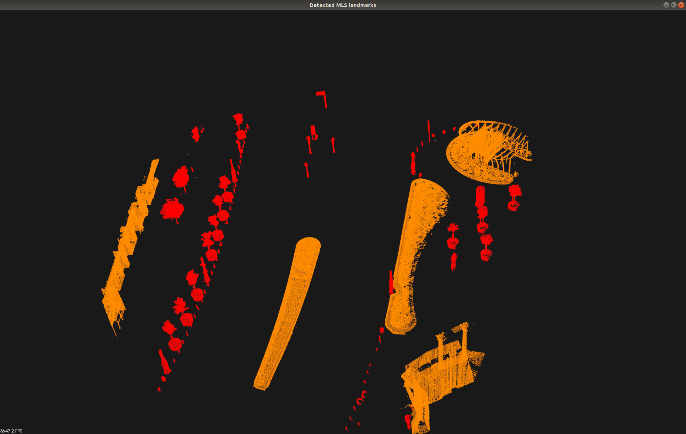
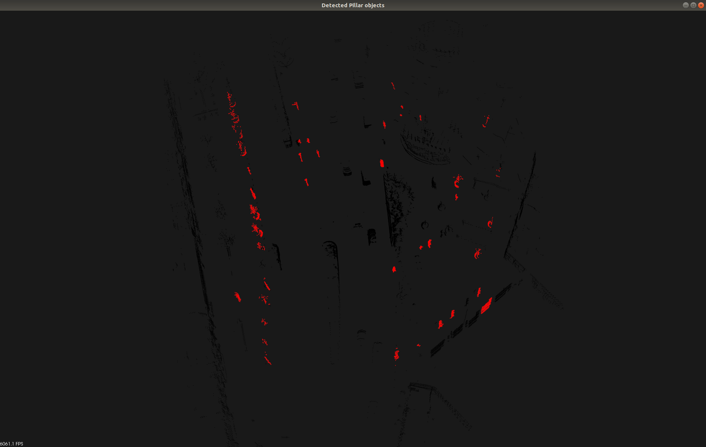
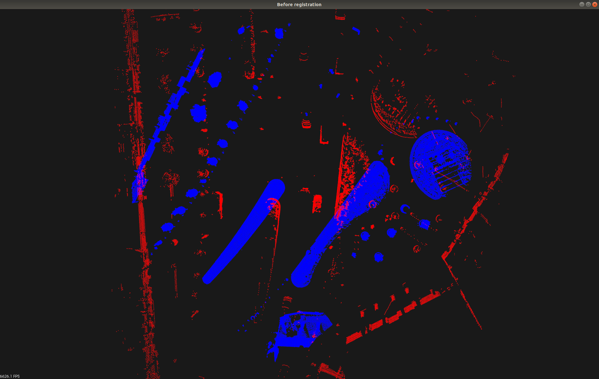
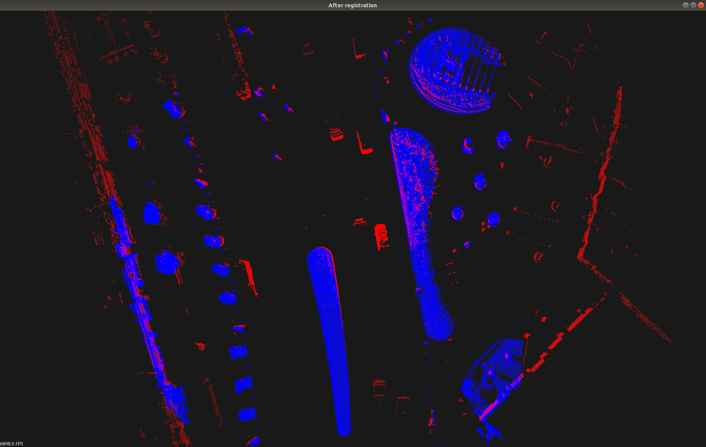
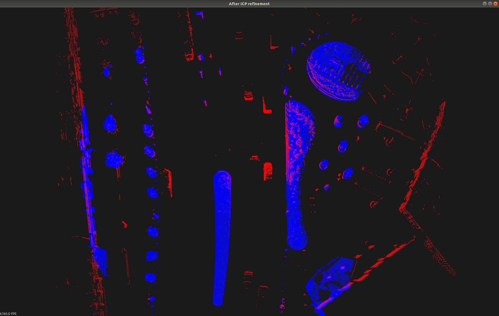
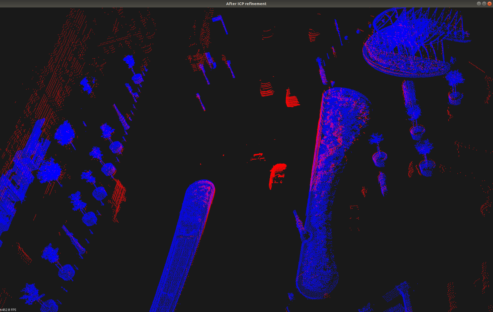
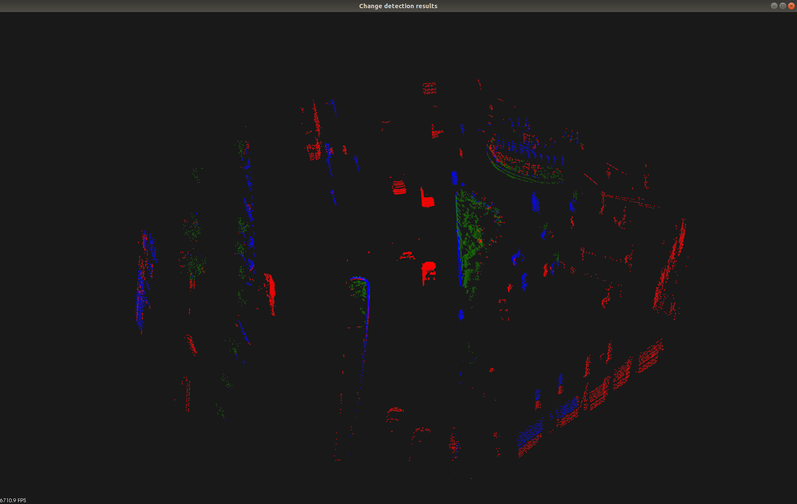

# Point Cloud Registration and Change Detection in Urban Environment Using an Onboard Lidar Sensor and MLS Reference Data
Supplementary material to our submitted paper in the International Journal of Applied Earth Observation and Geoinformation, 2022\
 \
Left: MLS point cloud obtained in Kálvin square, Budapest, Hungary. <br/>
Right: Point cloud frame captured by a Velodyne HDL64E sensor in Kálvin square, Budapest, Hungary. <br/>
## Dataset
The full dataset used in the paper can be downloaded [from this link](http://gofile.me/5waZC/xac75WX2X).\
The description of the dataset and its usage is available [here](docs/benchmark.pdf).
## Citation
If you found this work helpful for your research, or use some part of the code, please cite our submitted paper (currently under review):

```text
@article{lidar-scu, 
	title={{Point Cloud Registration and Change Detection in Urban Environment Using an Onboard Lidar Sensor and MLS Reference Data}}, 
	author={Zováthi, Örkény and Nagy, Balázs and Benedek, Csaba}, 
	journal={International Journal of Applied Earth Observation and Geoinformation}, 
	year={2022},
	note={under review}
}
```

## Installation guide
The code was written in C++ and tested on a desktop computer with Ubuntu 18.04.
Please carefully follow our installation guide.

#### Dependencies:
PCL-1.8.1\
Eigen3\
OpenCV\
CMake

#### Install PCL and Eigen3:
```sh
$ sudo apt install libeigen3-dev libpcl-dev
```
#### Build OpenCV from source:
Please follow the instructions of [this tutorial](https://linuxize.com/post/how-to-install-opencv-on-ubuntu-18-04/#installing-opencv-from-the-source).

#### Setting up the project:
1. Clone this repository
2. Build the project:
```sh
$ mkdir build && cd build
$ cmake ..
$ make -j10
```
3. Run the project on sample demo data:
```sh
$ ./Lidar-SCU
```

#### Required data-structure:
|--project_root:\
&nbsp;&nbsp;&nbsp;|--Data:\
&nbsp;&nbsp;&nbsp;&nbsp;&nbsp;&nbsp;|--Samples:\
&nbsp;&nbsp;&nbsp;&nbsp;&nbsp;&nbsp;&nbsp;&nbsp;&nbsp;|--Velo1.pcd\
&nbsp;&nbsp;&nbsp;&nbsp;&nbsp;&nbsp;&nbsp;&nbsp;&nbsp;|--MLS1.pcd\
&nbsp;&nbsp;&nbsp;&nbsp;&nbsp;&nbsp;&nbsp;&nbsp;&nbsp;|--Velo2.pcd\
&nbsp;&nbsp;&nbsp;&nbsp;&nbsp;&nbsp;&nbsp;&nbsp;&nbsp;|--MLS2.pcd\
&nbsp;&nbsp;&nbsp;&nbsp;&nbsp;&nbsp;&nbsp;&nbsp;&nbsp;|--Velo3.pcd\
&nbsp;&nbsp;&nbsp;&nbsp;&nbsp;&nbsp;&nbsp;&nbsp;&nbsp;|--MLS3.pcd\
&nbsp;&nbsp;&nbsp;&nbsp;&nbsp;&nbsp;&nbsp;&nbsp;&nbsp;|--Velo4.pcd\
&nbsp;&nbsp;&nbsp;&nbsp;&nbsp;&nbsp;&nbsp;&nbsp;&nbsp;|--MLS4.pcd\
&nbsp;&nbsp;&nbsp;&nbsp;&nbsp;&nbsp;&nbsp;&nbsp;&nbsp;|--Velo5.pcd\
&nbsp;&nbsp;&nbsp;&nbsp;&nbsp;&nbsp;&nbsp;&nbsp;&nbsp;|--MLS5.pcd\
&nbsp;&nbsp;&nbsp;&nbsp;&nbsp;&nbsp;|--Output:

## Simple usage:
Run the algorithms on your own sample demo data pair:
```sh
$ ./Lidar-SCU path_to_rmb_lidar_frame.pcd path_to_mls_data.pcd
```
By default, the execution follows the steps below. At each step, one should see similar outputs as listed here. Please close each figure to go to the next step.
#### 1. Landmark object extraction from dense MLS point clouds
Expected output:\


Color code: red = pillar-like columns, orange = other static objects
#### 2. Object detection in sparse Lidar scans
Expected output:\


Color code: red = pillar-like object candidates
#### 3. Bounding-box-based coarse registration
Expected output:\


Color code: red = RMB Lidar, blue = MLS map
Left: before alignment
Right: after alignment
#### 4. Standard ICP alignment
Expected output:\


Color code: red = RMB Lidar, blue = MLS map

#### 5. Range-image generation and MRF-segmentation
Expected output:\


#### 6. Change detection in 3D
Expected output:\


Color code: blue = static, red = dynamic change, blue = vegetation change

##### For more details, please address our paper.

## Authorship declaration
The code of this repository was implemented in the [Machine Perception Research Laboratory](https://www.sztaki.hu/en/science/departments/mplab), Institute of Computer Science and Control (SZTAKI), Budapest.\

